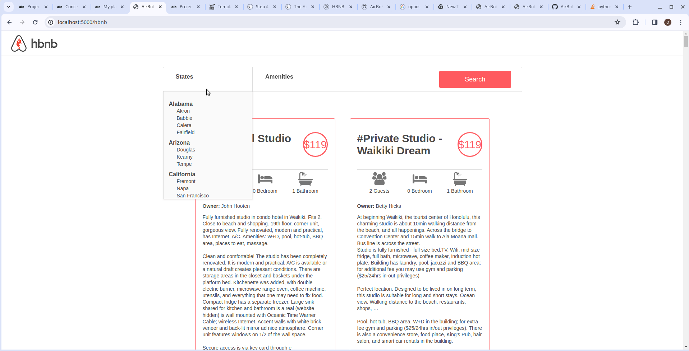

# AirBnB clone - Web framework

In this project I utilized `Flask`, a python web application to make  static HTML file dynamic by using objects stored in a file or database. Upon completing this project, I gained full knowledge on flask:
- Routing
- jinja templating -writing views
- How to start a minimal flask application

