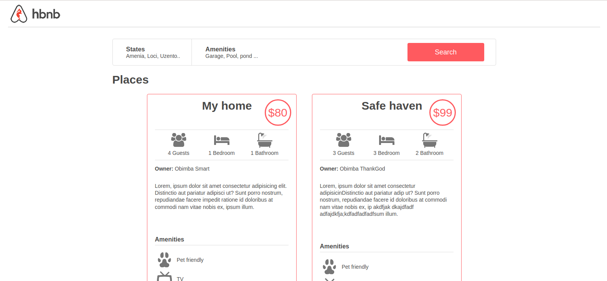

# AirBnB clone - Web static
> Front-end of the AirBnB clone project using pure `HTML`, and `CSS`

This project has deepened my comprehension of styling and organizing HTML content. Notably, it highlighted the significance of compartmentalizing sections, each with its dedicated CSS file for styling. For instance, the `4-filter.css` file contains styles exclusively tailored for the filter section, while `common.css` encompasses styling elements shared across all sections on the page. I find this approach particularly effective and enjoyable.

